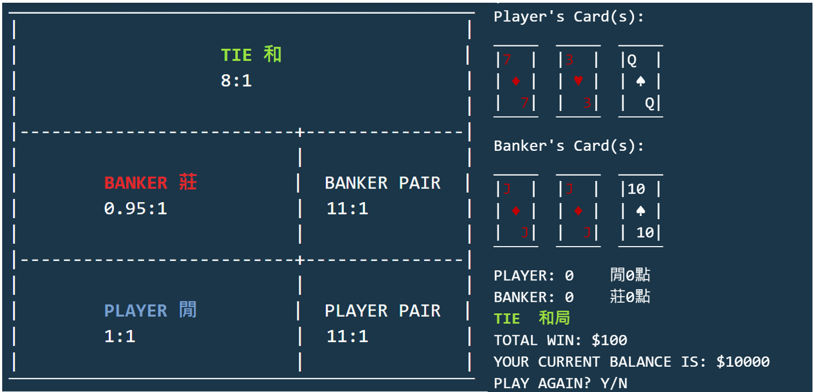
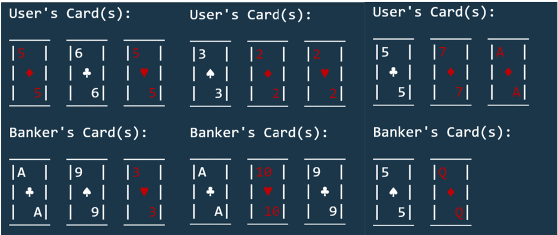
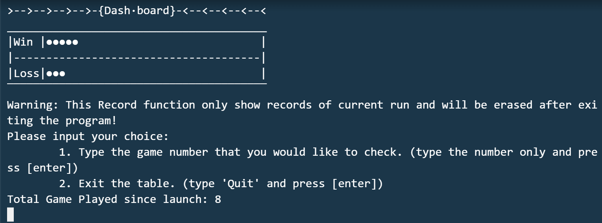
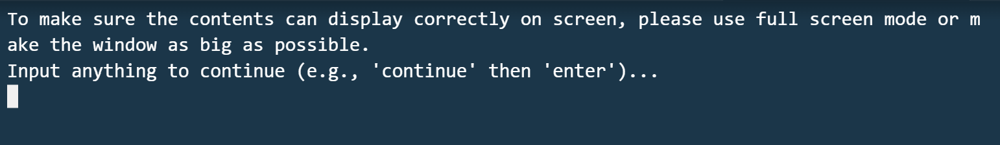
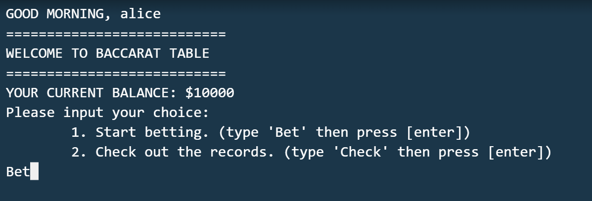
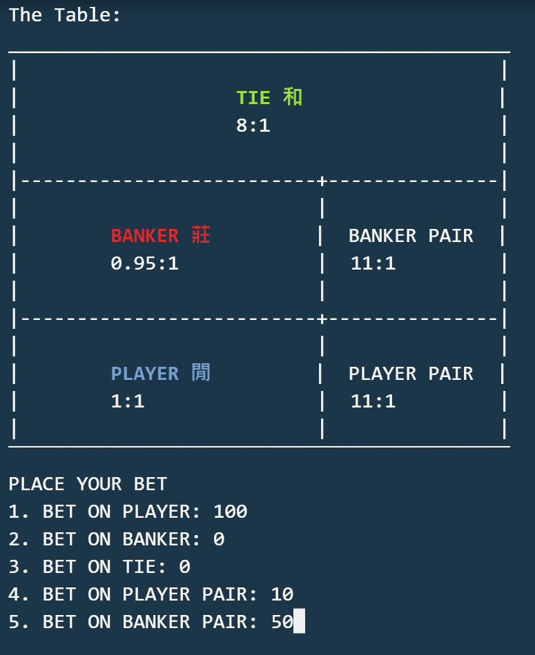
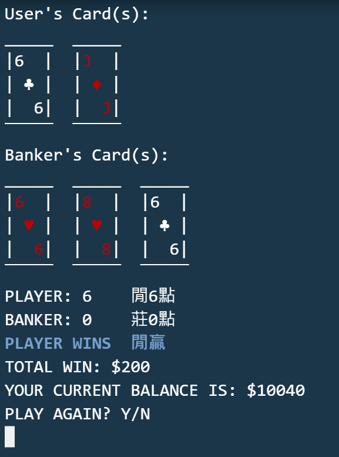
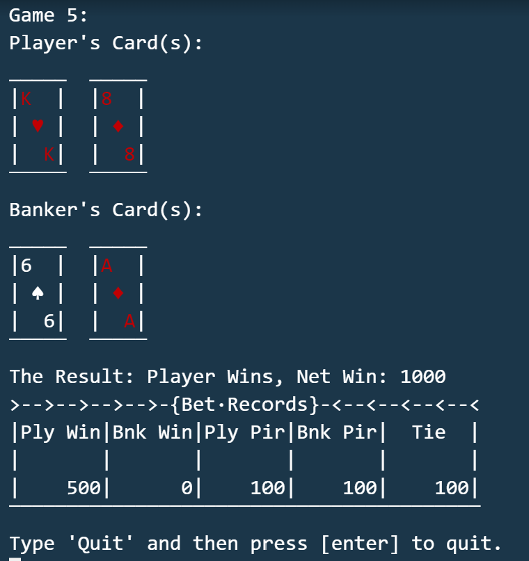

# C++ Baccarat
Group project submission for HKU COMP2113 course, 2022-23 Sem 1.

Group members:
- WANG SONGYUE (3035945716)
- LUO RUIDI (3035835648)
- GAN JIAHAO (3035859242)
- LU PENGRAN (3035950553)
- WU HOI CHING (3035931208)

Featured screenshot:



[Demo video](https://www.youtube.com/watch?v=ivXifSZQ41A)

## Introduction


Baccarat is one of the most popular poker games in casino. It has two hands: player and banker.
For each game, there will be three possible outcomes: player wins (player has a higher score), banker wins,
or tie (player and banker have the same score). Although the determination of winner is straightforward, the 
underlying logic for deciding who receives an extra card is relatively complex, which made this ancient gambling 
game exciting and interesting. 

The user can bet on one or more cases with different payout ratios.

| Case | Payout Ratio | 
| :---: | :---: |
| player wins | 1:1 |  
| banker wins | 0.95:1 |  
| tie | 8:1 |  
| player pair | 11:1 |  
| banker pair | 11:1 |  

For more details, please refer to this page:
[Detailed Baccarat Rules](https://www.casinocity.com/rule/baccarat.htm)

## Programme Features

After studying other command line casino games written in Python/C++/Java published in Github, we noticed that many games are far from reality. For some cases, classical features are even lost. In this programme, we focused on the graphics, as well as other C++ features to make this game seemed similar to a real baccarat game.

1. Random number generation (Requirement 1)
    
    We implemented a function to generate poker cards randomly. The random variables we handled include face value, color,
    and suit of a card. Like a real online casino, we do not define a deck of poker cards to draw from. Instead, the card generated
    are completely random using the PRNG.

2. Various data structure (Requirement 2)

    To fulfill practical needs and ensure collaboration efficiency in coding, we used various data structures in the programme.
    
    | Data to Handle | Description | Data Structure Used | 
    | :---: | :---: | :---: |
    | bets placed | bets placed by the user on different cases  | array | 
    | poker cards | cards dealt to the banker or player | vector | 
    | account | struct stores username and balance | vector |
    
3. Dynamic mememory (Requirement 3)
    
    In this programme, dynamic memory management tools, such as pointer, is used in handling some data, like game records, and the accounts.
    No matter the users' account is found or not in the account file we saved, we will create a temporary pointer to store the current users'
    information. After the game, its information will be updated back to the vector, and write into file.

4. Account-based game data saving & File IO (Requirement 4)

    When a user enters a new username at the beginning of the game, an account will be created. Once the player stopped
    playing, the username and corresponding balance will be saved to a file. Hence, the player can always retrieve his/her
    balance at a later time.

5. Decent graphics

    Unlike other text-based games, we make substantial efforts in enhancing the graphics by designing the appearance of the casino
    table and poker cards, with simple `cout` syntax.

    

6. Makefile (Requirement 5)

    By implementing separated compilation, the codes will be easier to maintain or modify.
    
7. Personalized greeting message
    
    We used `ctime` package to get local time for the user's machine, hence produce personalized greeting message.

8. Winnings record (路圖)
    
    Like a physical casino, a personal winnings record is provided to the player, so he/she can keep track of the earning/loss on a game session.
    As an add-on feature, the player can even review the bets placed and cards dealt in a past game.

    
    
## Usage

### Getting Started

1. Compile source codes to get `main` executable.

```
make main
```

2. Start the Baccarat programme

```
./main
```

### Playing

1. Make sure the console screen is large enough, then hit `return`.

    

2. You will be prompted to type in a username (case sensitive).

- If the username is already in the `accounts.txt` file, you will receive a "welcome back"
message, and the balance will be retrieved.

    Testing accounts: `alice` and `bob`.

- If the username is new, a new account will be created, with an initial balance of `$10000`.

    

Then, type `Bet` and hit enter.

3. Place the bets. You may bet on multiple cases.
    
    Note: The bets must be positive integers. If you enter invalid input or the total bet exceeds your balance, you will be prompted to type again.

    

4. Cards will be dealt and results will be displayed.
    
    

    You can play with multiple hands before moving to the next part!

5. Type `Y`, hit `return`, then type `Check` to view winnings chart.

    

6. Enter a game ID (starting from `1`) to retrieve cards and betting records for that specific game.

    
    
7. If you choose to exit the game after one hand, you will receive a goodbye message, and the programme will be terminated.

## Contributions

- WANG SONGYUE: part of `main.cpp`, `check_card.cpp`, `check_card.h`, `README.md`
- LU PENGRAN: `Makefile`, `graphic.cpp`, `graphic.h`
- LUO RUIDI: `generateCard.cpp`, `fileIO.cpp`, `generatedCard.h`, `fileIO.h`
- GAN JIAHAO: `main.cpp`
- WU HOI CHING: in-code comments, `README.md`

## License
Distributed under the MIT License. See `LICENSE.md` for more information.